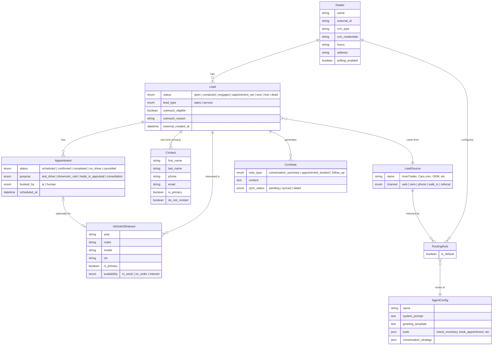

# Comprehensive Interview Prep Guide

**Position:** Senior Engineer – Sales Outbound (0→1)

**When to use:** Read this 1 day before the interview (30-45 min read)

---

## Table of Contents

1. [Interview Philosophy](#interview-philosophy)
2. [The Scenario Frame](#the-scenario-frame)
3. [Phase 1: Model the Domain](#phase-1-model-the-domain)
4. [Phase 2: Operationalize It](#phase-2-operationalize-it)
5. [Phase 3: Own It](#phase-3-own-it)
6. [Bonus: Equity Mining Curveball](#bonus-equity-mining-curveball)
7. [Red Flags](#red-flags)
8. [Scoring Framework](#scoring-framework)

---

## Interview Philosophy

**You're not testing whether they know your stack. You're testing whether they think like an owner.**

Three phases, one flowing session:
1. **Model the domain** — Can they look at a messy real-world problem and extract the right entities — both the CRM domain and the AI agent configuration?
2. **Operationalize it** — Can they take the model they just designed and automate provisioning it?
3. **Own it** — When a dealer asks for a feature, do they ship it or test it? Can they build a system for continuous improvement?

**Why one flowing session, not three exercises:**
The right person connects these naturally. Their data model informs what gets automated in phase 2, and their agent configuration model is what they A/B test in phase 3. If you have to prompt each transition, that's a signal. If they connect them unprompted, that's a stronger signal.

**Why Google Doc format:**
Writing forces clarity. You see their process, not just their conclusion. It also matches how your team works — async, written communication, structured thinking.

---

## The Scenario Frame

### Setup (5 min)

Share the Google Doc. Say:

> "I'm going to give you a scenario based on a real product. I want to see how you think through it — domain modeling, operations, product ownership. There's no trick. Take your time, write out your thinking in the doc."

### The Scenario (Say This)

> "You're taking over an outbound sales product for auto dealerships. Dealerships get hundreds of sales leads every month — from their website, AutoTrader, Cars.com, OEM programs, walk-ins, phone calls. Most leads go cold because the sales team can't respond fast enough. We use AI to reach out instantly via SMS, have a conversation, and book appointments — test drives, showroom visits, trade-in appraisals. We sync everything back to the dealer's CRM so their sales team can pick up where the AI left off.
>
> 40 dealers live today. Scaling to 200.
>
> You're taking this over from me."

---

## Phase 1: Model the Domain

### The Prompt (Say This)

> "Before you touch any code, you need to understand the domain. How would you model this? Both the dealership/CRM side — leads, customers, vehicles, appointments — and the AI agent side — how the agent knows what to say, how different lead types get different treatment."

**Don't list entities.** Don't give them more than this. The test is whether they can look at the scenario and extract the right model through clarifying questions and domain reasoning.

### What You're Testing

**Can they look at a messy real-world problem and intuit the right domain model — including the agent configuration layer?**

There are two halves to this domain:
- **The CRM side:** dealerships, leads, contacts, vehicles, appointments, CRM notes — what the product works with
- **The agent side:** how the AI knows what to say, how different lead types or dealerships get different behavior — how the product behaves

Most candidates will get some version of the CRM side. The agent configuration side is where you separate people who think about the product holistically from people who just think about data storage.

### The Model ERD (What Great Looks Like)

This is the target model — what an incredible candidate arrives at through questions and domain reasoning. They won't match this exactly, but their instincts should be in the same direction.

**CRM side (7 entities):** Dealer, Lead, LeadSource, Contact, VehicleOfInterest, Appointment, CrmNote — what the product works with.

**Agent side (2 entities):** AgentConfig, RoutingRule — how the product behaves.

**The bridge:** LeadSource connects the two sides. A Lead came from a LeadSource. A RoutingRule maps (Dealer + LeadSource) → AgentConfig. LeadSource is where the CRM domain meets the agent domain.

### CRM Side — What Great Looks Like

They should discover these entities through questions, not be handed them:

1. **Ask clarifying questions to discover entities:**
   - "What's a 'lead' exactly — is that the person, or the opportunity?"
   - "Can one person have leads at multiple dealerships?"
   - "When you say 'vehicles' — is that what the customer wants, or what the dealership has in stock?"
   - "What happens after an appointment? Can it be rescheduled? No-showed?"
   - "You said leads come from different sources — is a source like AutoTrader just a label, or is it a real thing with its own properties?"

2. **Identify the right entities:**
   - **Dealer** — the dealership, with its own CRM config
   - **Lead** — the unit of work. Belongs to one dealer. Has lifecycle states.
   - **LeadSource** — where the lead came from (AutoTrader, Cars.com, OEM, walk-in). A first-class entity, not just a string on Lead. Has a channel type (web, oem, phone, walk-in, referral). This is the bridge to the agent side.
   - **Contact** — separate from Lead (because co-buyers exist, because contact info is what drives outreach)
   - **VehicleOfInterest** — what the customer wants, NOT inventory (intent vs reality)
   - **Appointment** — with purpose (test drive, showroom, trade-in) and lifecycle (scheduled, confirmed, completed, no-show, cancelled). Who booked it — AI or human.
   - **CrmNote** — the write-back to the dealer's CRM. They should surface this from the scenario ("we sync everything back") without being told it's an entity.

3. **Think about lifecycle states unprompted:**
   - Lead: open → contacted → engaged → appointment_set → won/lost/dead
   - Appointment: scheduled → confirmed → completed/no_show/cancelled
   - They should ask: "What does 'done' mean for a lead? Who decides?"

### Agent Side — What Great Looks Like

This is the differentiator. After (or while) modeling the CRM side, they should ask:

- "You said different lead types get different treatment — how does the AI know what to say? Is there some kind of agent config or template?"
- "Does each dealership have its own AI personality? Or is it one agent for everyone?"
- "How does a lead get routed to the right behavior? Is it based on the source? The dealer?"

The model they arrive at should include:
- **AgentConfig** — the AI's behavior definition. System prompt, greeting template, what tools it can use (check inventory, book appointment), conversation strategy.
- **RoutingRule** — maps (Dealer + LeadSource) → AgentConfig. This is how a lead gets matched to the right AI behavior. Each dealer has at least one default rule; they can add source-specific rules for different treatment.
- Dealership-specific info (name, hours, address) should live on the Dealer, not duplicated into the AgentConfig. The agent combines behavior from AgentConfig with context from Dealer at runtime.

**They don't need to get this perfect.** But they should recognize that "how the AI behaves" is a first-class part of the domain model, not just "a prompt somewhere." And LeadSource as a bridge entity — connecting what kind of lead it is to how the AI should handle it — is the key insight.

### Signals

- ✅ Asks clarifying questions to discover entities, doesn't ask you to list them
- ✅ Separates Contact from Lead, VehicleOfInterest from inventory
- ✅ Surfaces CrmNote from the scenario description without being told
- ✅ Thinks about lifecycle states before drawing anything
- ✅ Makes LeadSource a first-class entity, not just a string
- ✅ Models the agent/behavior layer, not just the data layer
- ✅ Connects the CRM side to the agent side through LeadSource → RoutingRule
- ❌ Asks "can you list the entities?" or starts with database columns
- ❌ No clarifying questions — jumps straight to designing
- ❌ Flat model with no lifecycle states
- ❌ Source is just a string on Lead — no bridge to the agent side
- ❌ No concept of the agent configuration — treats AI behavior as outside the domain

### How This Maps to the Real Codebase

**CRM side (Prisma schema):**
- `Lead` with `lead_type` (sales, service, parts), `source_channel`, `source_name`
- `LeadSource` entity for per-dealer source configuration
- `LeadContact` with `is_primary`, `do_not_contact`
- `LeadVehicle` with `availability` (in_stock, on_order, interest)
- `Appointment` with `purpose` enum, `status` lifecycle, `booked_by` (pam, human)
- `CrmNote` with `note_type` (conversation_summary, appointment_booked, etc.)

**Agent side:**
- `agents/` folder with separate agent configs (sales-crm-leads, equity-mining)
- Each agent has its own prompt, greeting builder, tools (check_inventory, book_test_drive)
- `ClientOrgCampaign` maps (client_org_id, source_name) → campaign for routing
- `resolveSourceCampaign()` does the routing logic — exact match on source, fall back to default

The candidate doesn't need to match this exactly. But their instincts should be in the same direction — especially LeadSource as a first-class entity and routing as a (Dealer + Source) → Agent mapping.

---

## Phase 2: Operationalize It

### The Prompt (Say This)

Transition naturally from Phase 1:

> "Good model. Now — when a dealer buys our product, a deal closes in HubSpot. Right now an engineer spends 30-60 minutes getting them live — setting up their CRM connection, configuring the AI, verifying it works. We're at 40 dealers, going to 200. How would you make this zero engineer time?"

**That's it.** Don't tell them to download historical data, discover sources, match templates, or run simulations. The test is whether they ask the right questions and arrive at those concepts themselves.

### What You're Testing

**Can they design a self-bootstrapping system that goes from a sales event to a live dealer — including discovery, configuration, verification, and monitoring?**

This phase directly tests the quality of their Phase 1 model. The LeadSources, RoutingRules, and AgentConfigs they designed are exactly what needs to be automatically created. If their model was thin, this phase will feel abstract. If their model was rich, they'll have a clear picture of what the system needs to bootstrap.

The key concepts they should hit:

1. **Event-driven trigger** — HubSpot deal close kicks off the pipeline
2. **Discovery from data** — download historical CRM data to auto-discover lead sources and understand the dealer's patterns (volume, source mix, lead profile)
3. **Deterministic agent assignment** — match discovered sources against a library of proven AgentConfigs. Known source (AutoTrader) → use the proven template. Unknown source → flag for human review, don't guess.
4. **Simulation testing** — inject test leads, run through the full pipeline, verify conversations and booking work correctly before going live
5. **Autonomous go-live with monitoring** — system goes live when tests pass. Ongoing reliability monitoring per dealer. If performance drops or reliability issues → auto-disable and flag.
6. **Rollback** — if anything breaks post-launch, the system can roll back to a safe state

### What Great Looks Like

1. **Connects to their data model:**
   > "Based on what I designed, getting a dealer live means creating: the Dealer record, discovering their LeadSources from historical CRM data, creating RoutingRules that map each source to the right AgentConfig, and verifying the whole pipeline works. Let me think about the stages."

2. **Thinks in stages with checkpoints:**
   > "This is a pipeline with checkpoints:
   > - **Connected** — CRM credentials work, we can pull data
   > - **Discovered** — we've downloaded historical leads and identified their source mix
   > - **Configured** — each source has an agent config (template match or flagged)
   > - **Verified** — simulation tests pass end-to-end
   > - **Live** — polling enabled, real leads flowing
   >
   > Each stage is idempotent. If it fails, I retry from that checkpoint, not from scratch."

3. **Discovery from historical data:**
   > "I'd pull their historical leads — say last 6 months — and analyze the source distribution. How many AutoTrader leads, how many OEM, how many walk-ins. This tells me which LeadSources to create and what volume to expect. It also tells me if there are sources I've never seen before."

4. **Deterministic agent assignment with edge case handling:**
   > "For known sources — AutoTrader, Cars.com — I match against a library of proven AgentConfigs. These are templates that we know convert well. Exact match → assign automatically.
   >
   > For unknown sources — a source name I haven't seen before — I don't guess. I flag it for human review. The dealer can still go live with their known sources while we figure out the unknown one. Don't block the whole onboarding for an edge case."

5. **Simulation before go-live:**
   > "Before enabling real traffic, I'd run simulations: inject a synthetic lead for each configured source, run it through eligibility, outreach, conversation, appointment booking, CRM note sync. Verify the AI says the right things and the whole pipeline completes. If simulation fails, the dealer stays in 'configured' state and the system alerts us."

6. **Monitoring and auto-rollback:**
   > "After go-live, per-dealer monitoring: are leads flowing? Are conversations happening? Are appointments booking? Is the CRM sync working? If any of these degrade — appointment rate drops below threshold, error rate spikes, CRM sync starts failing — auto-disable that dealer's outreach and alert. Don't let a broken dealer run for days before someone notices.
   >
   > Rollback means: disable polling, pause active journeys, flag for investigation. The system protects itself."

### What Mediocre Looks Like

> "I'd build an automation that takes HubSpot data and creates the dealer record and config. Then I'd run a health check and enable polling."

Gets the trigger right, creates the records, but no discovery from historical data, no template matching for agents, no simulation testing. Treats it as "create records and flip a switch" rather than a self-bootstrapping system. Monitoring is an afterthought.

### What Bad Looks Like

> "I'd build an admin panel. When the deal closes, someone gets notified, fills in the dealer info, picks an agent template, and clicks 'Go Live.'"

Still requires a human for every dealer. No discovery, no automation, no simulation. Just a form with a button. At 200 dealers this doesn't scale.

### Follow-Up: Ongoing Reliability

If they're doing well:

> "You're live with 200 dealers. Outreach journeys sometimes break — CRM sync fails, leads get stuck, agent says something wrong. Right now an engineer runs a script to fix it. How does your system handle this?"

**What great looks like:**
- Automated detection: "Lead enrolled 24+ hours ago with no CRM note → something broke"
- Self-healing: retry with exponential backoff, dead-letter after N failures
- Per-dealer health score: appointments booking? CRM syncing? error rate?
- Auto-disable: if a dealer's reliability drops below threshold, pause outreach, alert
- "The system tells you which dealers need attention. An engineer only gets involved when it can't self-heal."

**What bad looks like:**
- "I'd improve the script to make it easier to run"
- No mention of detection — only reaction
- No auto-disable — broken dealers stay broken until someone notices

### How This Maps to the Real Codebase

The actual system:
- Dealer onboarding is entirely manual (DB inserts, CRM config, campaign mapping, agent setup)
- No HubSpot integration for triggering onboarding
- No historical data pull or source discovery — sources are manually configured
- `ClientOrgCampaign` rows are inserted manually for routing
- `re-enroll.ts`, `validate-cron.ts`, `trigger-poll.ts` are manual ops scripts
- Enrollment is synchronous with no retry queue — if it fails, it fails
- `PollEvent` logs poll attempts but no automated per-dealer alerting
- Alarm enricher Lambda catches system-level errors → Slack, but not per-dealer health
- No simulation testing infrastructure

---

## Phase 3: Own It

### Beat 1: The Customer Email

Transition from Phase 2:

> "Good. Now let's talk about what happens when the product is live and dealers start having opinions. You get this email from a dealer:
>
> *'Hey, when a customer says they're interested in a car, can you have Pam check if we have it in stock and tell them about it before trying to book? Right now she goes straight to asking when they can come in, but I think customers want to know we have the car before they commit to a visit.'*
>
> What do you do?"

### What You're Testing

**Do they take the feature request at face value, or do they reverse-engineer the problem?**

The dealer is proposing a conversation strategy: inventory-first (show them what you have, then book) vs the current approach, appointment-first (book the visit, they'll see inventory in person). Both are valid strategies with real tradeoffs.

### What Great Looks Like

1. **Recognizes this as a hypothesis, not a feature request:**
   > "The dealer is saying 'I think customers want to know about the car first.' That's a hypothesis. They might be right, but I wouldn't just change the prompt based on one dealer's intuition."

2. **Articulates the tradeoffs:**
   > "Inventory-first might increase appointment quality — they know what they're coming for, so they're more likely to show. But it might decrease appointment volume — if we don't have their exact car, they disengage before we get them in the door. Appointment-first gets more people committed but maybe with higher no-show."

3. **Proposes testing it:**
   > "I'd A/B test it. Same dealer, same lead sources — half get inventory-first, half get appointment-first. Measure appointment set rate AND show rate, not just one. The winner depends on which metric we optimize for."

4. **Thinks about what metric matters:**
   > "Appointment rate alone isn't enough. If inventory-first books fewer appointments but they all show up and buy, it's the better strategy. I need to measure downstream — show rate, maybe even close rate."

### What Mediocre Looks Like

> "That's a good idea. I'd update the agent prompt to check inventory first. Maybe make it configurable per dealer."

Ships the feature. Doesn't question whether it's actually better.

### What Bad Looks Like

> "Sure, I'll add an inventory check step to the conversation flow. Should take a couple days."

Pure implementer. Didn't question the request, didn't think about tradeoffs, didn't consider measurement.

### Beat 2: Systematic Optimization

After they've handled the email:

> "Okay, you've been running this for 6 months. 200 dealers. You're getting requests like that all the time — dealers have opinions about how the AI should behave. How would you systematically figure out what actually works and make the AI better? Not one-off prompt tweaks — a system."

### What You're Testing

**Can they design a system for continuous improvement? And does their data model from Phase 1 support it?**

### What Great Looks Like

1. **A/B testing as infrastructure, not ad hoc:**
   > "I'd build experimentation into the agent config. Each agent behavior can have variants — different prompts, different conversation strategies. Leads get randomly assigned to a variant, and we measure conversion per variant."

2. **Extends the data model from Phase 1:**
   > "My agent config from earlier would need to support versions or variants. An agent has a base config and one or more experimental variants. Each lead's journey is tagged with which variant it got."

   The test here: can they go back to their Phase 1 model and evolve it cleanly? If they designed the agent config as a monolith, do they refactor it to support variants? The ability to extend a design under new requirements is exactly what this role demands.

3. **Knows what to measure:**
   > "The metric hierarchy matters. Response rate is cheap but misleading. Appointment set rate is better. Show rate is what actually matters. I'd optimize for the deepest metric I can reliably track."

4. **Thinks about statistical rigor:**
   - "How many leads do I need per variant before the result is meaningful?"
   - "Do I run tests per dealer or across all dealers? Results might not generalize."
   - "How long do I run it? Seasonality and lead source mix could confound results."

### What Mediocre Looks Like

> "I'd collect feedback from dealers, prioritize the most common requests, and iterate on the prompts. Maybe track before/after metrics when we make changes."

Not wrong, but no experimentation framework. Changes are reactive, not systematic. Before/after without control groups isn't rigorous.

### What Bad Looks Like

> "I'd keep improving the prompts based on dealer feedback. If they say it's working, it's working."

Vibes-driven development. No measurement, no testing, defers to sentiment.

### Follow-Up: The Measurement Gap

> "You run the inventory-first vs appointment-first test. Inventory-first has a lower appointment set rate, but the dealer swears their show rate is better. You don't track show rate. What do you do?"

**What great looks like:**
- "I need to close the measurement loop. Show rate is the metric that actually matters and I can't make this decision without it."
- "The CRM should know if the appointment was completed or no-showed. I need to build that tracking."
- "Until I have show rate data, I can't declare a winner. I'd keep running both variants while I build the measurement."
- "This is exactly why you need to design measurement before running experiments. I should have had show rate tracking before starting the test."

**What bad looks like:**
- "If the dealer says show rate is better, I'll trust them and go with inventory-first."
- "Appointment set rate is lower, so appointment-first wins."
- Either extreme — trusting sentiment without data, or optimizing for the wrong metric.

### How This Maps to the Real Codebase

The actual system:
- No A/B testing infrastructure exists
- Agent configs in `agents/` are monolithic — one config per agent, no variant support
- Funnel tracking stops at SCHEDULED (contacted → engaged → appointment). No show/sold.
- PRD explicitly says show/sold "will require deeper CRM and DMS integration"
- Engagement is inferred by checking if a CRM note starts with "Customer:" — fragile
- `pam-metrics.ts` ignores the Lead boolean flags and infers status from CRM notes because the flags only update on the Tekion poll cycle
- Per-source performance tracking exists but no per-variant tracking
- `.pam/product/specs/equity-mining-agent.md` mentions "A/B test greetings" as future work

---

## Bonus: Equity Mining Curveball

**Use this if there's time remaining and the candidate is doing well.** It's a bonus signal, not a core part of the interview.

After Phase 1 or at the end of the interview:

> "We're adding a second use case — equity mining. We re-engage existing customers who might be ready to trade in their vehicle. Same dealerships, same customers. Different outreach strategy, different appointment types, different AI conversation. How does your model change?"

**What great looks like:**
- Their model already handles it (lead_type enum, appointment purpose enum, agent config per type)
- They refactor cleanly — shared entities, divergent configuration
- "The abstraction holds"

**What bad looks like:**
- Panic, parallel tables, bolt-on architecture
- `equity_mining_lead`, `equity_mining_appointment` as separate entities

---

## Red Flags

**If you see 2+ of these, it's a Strong No regardless of other signals.**

| Red Flag | What It Sounds Like | Why It's Dangerous |
|----------|--------------------|--------------------|
| **"List the entities for me"** | Can't extract a model from a domain description | Will need a spec for everything. Can't think independently. |
| **Tables first** | Starts listing columns before drawing relationships | Can't think in abstractions. Will build rigid schemas. |
| **No agent model** | Only models the data side, not the behavior side | Doesn't see the product holistically. Will miss half the domain. |
| **"I'd build a dashboard"** | Solution to every ops problem is a UI | Doesn't think about eliminating work, just making work prettier. |
| **Ships the feature request** | Changes the prompt because the dealer asked | Implementer. Doesn't question assumptions or test hypotheses. |
| **"That's a PM question"** | Defers product/measurement thinking | Not an owner. Wrong role. |
| **No failure modes** | Describes the happy path without mentioning what goes wrong | Will build brittle systems that break silently. |
| **Defers to sentiment** | "If the dealer says it's working, it's working" | Doesn't trust data. Will miss real problems. |
| **Activity metrics** | "Track how many messages we send" | Measures effort, not outcome. Will build vanity dashboards. |

---

## Scoring Framework

### Dimensions (Rate each 1-5)

| Dimension | 5 (Exceptional) | 3 (Solid) | 1 (Weak) |
|-----------|-----------------|-----------|----------|
| **Domain Modeling** | Discovers entities through questions, models both CRM and agent sides, lifecycle states | Reasonable CRM model, misses agent side or needs prompting | Tables first, no lifecycle, no questions |
| **Ops Thinking** | State machines, idempotency, failure modes, verification, self-healing | Has an automation plan but misses edge cases | "Build an admin panel" or "improve the script" |
| **Product Ownership** | Recognizes hypothesis, proposes testing, articulates tradeoffs | Ships the feature but thinks about measurement after | Takes feature request at face value |
| **Quantitative Rigor** | Designs experiments, knows what metric matters, closes the measurement loop | Knows to measure but doesn't go deep on metric selection | Measures activity, defers to sentiment |
| **Model Evolution** | Extends data model cleanly when new requirements emerge (variants, A/B testing) | Can extend with some awkwardness | Rigid model, can't adapt |
| **Curiosity** | Deep clarifying questions that reveal domain understanding | Asks some questions, makes some reasonable assumptions | No questions, jumps to solutions |
| **Communication** | Clear writing, structured thinking, easy to follow | Coherent but not exceptional | Rambling, unclear, disorganized |

### Overall Vote

| Vote | Meaning | When to Give |
|------|---------|--------------|
| **Strong Yes** | Will own this product Day 1. | 4-5 on most dimensions, connects all three phases |
| **Yes** | Solid hire. Will ramp quickly. | Mostly 3-4s, no 1s |
| **No** | Not ready for this role. | Any 1s in critical dimensions, implementer mindset |
| **Strong No** | Wrong person. | Multiple red flags, can't think in systems |

### Final Gut Check

1. **Would I trust this person to take over the Sales product from me?**
2. **Would I trust them to handle a dealer email without supervision?**
3. **Do they think like someone who runs things?**

If any answer is No or Not Sure → your vote is No.

---

## Remember

- **Let them drive.** Don't prompt the transitions between phases — see if they connect the dots themselves.
- **Shut up during their writing/thinking time.** Wait at least 5-7 minutes per phase before speaking.
- **One No = No Hire.** Everyone must say yes.
- **Owner vs implementer.** If they never ask "why does the dealer want this?" or "how would we know if this works?" — that's your answer.
