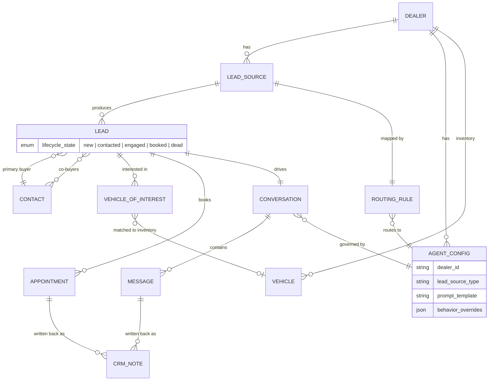

# CHEAT SHEET: Senior Sales Outbound Interview

**Have this open during the interview. Glance at it, don't read it.**

---

## Setup (5 min)

Share the Google Doc. Say:

> "I'm going to paste a scenario into this doc. I want to see how you think through it. Use the doc to write out your thinking — diagrams, bullets, whatever helps."

### Paste This in the Google Doc:

> **You're taking over an outbound sales product for auto dealerships.**
>
> Dealerships get hundreds of sales leads every month — from their website, AutoTrader, Cars.com, OEM programs, walk-ins, phone calls. Most leads go cold because the sales team can't respond fast enough. We use AI to reach out instantly via SMS, have a conversation, and book appointments — test drives, showroom visits, trade-in appraisals. We sync everything back to the dealer's CRM so their sales team can pick up where the AI left off.
>
> 40 dealers live today. Scaling to 200. You're taking this over from me.
>
> **I'm going to walk you through three questions about this product.**

---

## Phase 1: Model the Domain (20 min)

### Paste This in the Google Doc:

> **Question 1:** Before you touch any code, you need to understand the domain. How would you model this? Both the dealership/CRM side — leads, customers, vehicles, appointments — and the AI agent side — how the agent knows what to say, how different lead types get different treatment.

**Don't list entities. Don't give more context. Let them ask questions and discover the model.**

### Watch for:

**CRM side:**

| 🟢 Great | 🔴 Bad |
|----------|--------|
| Asks clarifying questions to discover entities | Asks you to list the entities |
| Draws relationships, not tables | Starts listing database columns |
| Surfaces CrmNote from the scenario (write-back) | Only models what was explicitly stated |
| Separates Contact from Lead (co-buyers) | Conflates them |
| Separates VehicleOfInterest from inventory | Conflates them |
| Thinks about lifecycle states unprompted | No lifecycle — just "status: open/closed" |

**Agent side:**

| 🟢 Great | 🔴 Bad |
|----------|--------|
| Asks "how does the AI know what to say?" | No concept of agent configuration |
| Models agent behavior as a first-class entity | Treats AI as a black box outside the domain |
| Asks about routing — different leads → different behavior | Assumes one agent for everything |
| Per-dealer customization as a concept | No dealer-specific config |

**Bonus signal:** If they intuit a campaign/routing/orchestration layer without being told it exists.

### Quick Glance — The Entities

```
CRM SIDE                          AGENT SIDE
─────────                         ──────────
Dealer                            AgentConfig (per dealer × source)
 ├─ LeadSource (AutoTrader, OEM…) RoutingRule (source → config)
 ├─ Vehicle (inventory)           Conversation
 └─ Lead ──→ lifecycle states      ├─ Message[]
      ├─ Contact (buyer)           └─ CrmNote[] (write-back)
      ├─ Contact[] (co-buyers)
      ├─ VehicleOfInterest ──→ matched to Vehicle?
      └─ Appointment ──→ CrmNote[] (write-back)
```

### Ideal ERD (Your Reference — Don't Show Candidate)



**What this tests:**
- `Contact` ≠ `Lead` — co-buyers share a Lead but are separate Contacts
- `VehicleOfInterest` ≠ `Vehicle` inventory — one is intent, one is stock
- `LeadSource` → `RoutingRule` → `AgentConfig` is the orchestration layer most miss
- `CrmNote` as a write-back entity (not just a field) shows they thought about the sync
- `Lifecycle` on `Lead` (not just `status: open/closed`) shows systems thinking

---

## Phase 2: Operationalize It (20 min)

### Paste This in the Google Doc:

> **Question 2:** When a dealer buys our product, a deal closes in HubSpot. Right now an engineer spends 30-60 minutes getting them live — setting up their CRM connection, configuring the AI, verifying it works. We're at 40 dealers, going to 200. How would you make this zero engineer time?

**Don't say more.** Let them ask questions and arrive at the stages themselves.

### Your Reference (Don't Show to Candidate)

**The ideal pipeline — track where they get on their own vs where you nudge:**

```
HUBSPOT DEAL CLOSES
       ↓
1. CONNECTED ── Create dealer, validate CRM credentials
       ↓         ❌ Bad creds → alert, stay here
2. DISCOVERED ── Pull historical leads, identify sources + volume
       ↓         Sets baseline expectations for monitoring
3. CONFIGURED ── Known source → proven agent template
       ↓         Unknown source → flag, don't guess
4. VERIFIED ── Simulate per source (test lead → AI → appointment → CRM sync)
       ↓         ❌ Source fails → disable that source, others proceed
5. LIVE ── Enable polling, real leads flowing
       ↓
MONITORING ── Per-dealer health vs baselines
               📉 Reliability drops → auto-disable, alert, rollback
```

### How to Guide Them (Nudges by Stage)

**If they're stuck at the start** (just describing "automate the manual steps"):
> "You have CRM access now. What could you learn about this dealer before you configure anything?"

This should get them to → **pull historical data / discovery**.

**If they get discovery but not template matching** ("I'd look at their leads to see what sources they have" but then stop):
> "Okay, you've discovered they have AutoTrader and OEM leads. How do you know what AI behavior to use for each?"

This should get them to → **proven templates for known sources**.

**If they template-match but don't handle unknowns** (assign configs for everything without questioning):
> "What if you see a source you've never encountered — something like 'GM Financial Customer Payoff Request'?"

This should get them to → **flag unknowns, don't guess**.

**If they configure but skip verification** ("then we go live"):
> "How do you know the AI is going to say the right thing before real customers get messages?"

This should get them to → **simulation testing**.

**If they verify but don't think about post-launch** ("simulation passes, we're good"):
> "You're live with 200 dealers. How do you know if one of them is broken right now?"

This should get them to → **per-dealer monitoring**.

**If they monitor but don't auto-protect** ("we'd alert someone and they'd investigate"):
> "It's 2am. A dealer's AI is sending bad messages. Nobody's awake. What happens?"

This should get them to → **auto-disable, rollback**.

### Tracking (Mark as they go)

- [ ] Gets to discovery from data on their own
- [ ] Gets to template matching on their own
- [ ] Handles unknown sources (flag, don't guess)
- [ ] Gets to simulation/verification on their own
- [ ] Gets to monitoring on their own
- [ ] Gets to auto-disable/rollback on their own
- [ ] Connects back to Phase 1 model (LeadSources, RoutingRules, AgentConfigs)

**Count how many they hit unprompted vs nudged. That's the signal.**

### Watch for:

| 🟢 Great | 🔴 Bad |
|----------|--------|
| Connects to Phase 1 model ("I need to create LeadSources, RoutingRules, AgentConfigs...") | Treats this as a separate problem |
| Discovers lead sources from historical CRM data | Expects manual config |
| Matches known sources to proven agent templates | "I'd build an admin form to pick a template" |
| Flags unknown sources for human review, doesn't guess | Tries to auto-handle everything or ignores unknowns |
| Simulation tests before go-live | "Then someone checks it" |
| Thinks in stages with checkpoints (connected → discovered → configured → verified → live) | Flat checklist |
| Per-dealer monitoring + auto-disable on reliability issues | Only thinks about onboarding |
| Rollback capability | No mention of failure recovery |

### Follow-up (if doing well):

> "200 dealers live. Journeys break — CRM sync fails, leads get stuck, agent says something wrong. Right now someone runs a script. How does your system handle this?"

🟢 Automated detection, self-healing with backoff, per-dealer health score, auto-disable + alert
🔴 "Improve the script" / no detection / no auto-disable

---

## Phase 3: Own It (20 min)

### Beat 1 — The Customer Email. Paste This in the Google Doc:

> **Question 3:** You get this email from a dealer: *"Hey, when a customer says they're interested in a car, can you have Pam check if we have it in stock and tell them about it before trying to book? Right now she goes straight to asking when they can come in, but I think customers want to know we have the car before they commit to a visit."* What do you do?

| 🟢 Great | 🔴 Bad |
|----------|--------|
| "That's a hypothesis, not a feature request" | "Sure, I'll update the prompt" |
| Articulates the tradeoff (inventory-first vs appointment-first) | Doesn't see the tradeoff |
| Proposes A/B testing it | Ships the change |
| Thinks about what metric to optimize (appointment rate? show rate?) | Doesn't mention measurement |

### Beat 2 — Systematic Optimization. Say This (verbal, after they answer Beat 1):

> "You've been running this 6 months. 200 dealers. Dealers constantly have opinions about how the AI should behave. How would you systematically figure out what works and make the AI better? Not one-off prompt tweaks — a system."

| 🟢 Great | 🔴 Bad |
|----------|--------|
| A/B testing as infrastructure | Ad hoc prompt changes |
| Extends Phase 1 agent model to support variants | No connection to their data model |
| Knows the right metric hierarchy (response → appointment → show) | Optimizes for activity metrics |
| Thinks about statistical rigor (sample size, duration) | "Run it for a week and see" |

### Follow-up:

> "You run inventory-first vs appointment-first. Inventory-first has lower appointment rate, but the dealer swears show rate is better. You don't track show rate. What do you do?"

🟢 "I need to close the measurement loop. Build show rate tracking before declaring a winner."
🔴 "Trust the dealer" or "appointment rate is lower, so appointment-first wins"

---

## 💀 KILLER QUESTION (Use on strong candidates)

> **"If you could only track one metric to know whether this product is working — one number — what would it be and why?"**

🟢 Something downstream: show rate, revenue per lead, appointments that convert
🔴 Activity metrics: messages sent, response rate, appointment set rate alone

---

## Bonus: Equity Mining Curveball (Time Permitting)

> "We're adding a second use case — re-engaging existing customers about trading in their vehicle. Same dealerships, same customers. Different outreach, different appointment types, different AI conversation. How does your model change?"

🟢 Model already handles it (lead_type, appointment purpose, agent routing)
🔴 Panics, creates parallel tables

---

## Instant Red Flags 🚨

**If you see 2+ of these → Strong No**

- Asks you to list the entities
- Starts with database columns, not domain relationships
- No concept of agent configuration in the domain model
- "I'd build a dashboard" as the answer to ops automation
- Ships the dealer's feature request without questioning it
- "That's a PM question" — defers product thinking
- Measures activity (messages sent) not outcomes
- Trusts dealer sentiment over data
- Only describes happy paths — no failure modes

---

## Scoring (Pick One)

| Vote | Meaning |
|------|---------|
| **Strong Yes** | Owns it Day 1. Models both sides, automates smart, tests hypotheses, connects all three phases. |
| **Yes** | Solid hire. Good instincts, some gaps. Will ramp. |
| **No** | Implementer, not owner. Missing key dimensions. |
| **Strong No** | Red flags. Can't think in systems. Wrong person. |

**Final check:** Would I trust this person to take over the Sales product from me?

---

## After Interview

**Within 5 minutes, write down:**
1. Best thing they said
2. Biggest concern
3. Your vote
4. Would you trust them running this product?

→ Use [04-scoring-debrief.md](04-scoring-debrief.md)

---

## Remember

- **Let them drive.** See if they connect the phases unprompted.
- **One No = No Hire.** If you're not a Yes, that's a No.
- **Owner vs implementer.** That's the whole interview.
