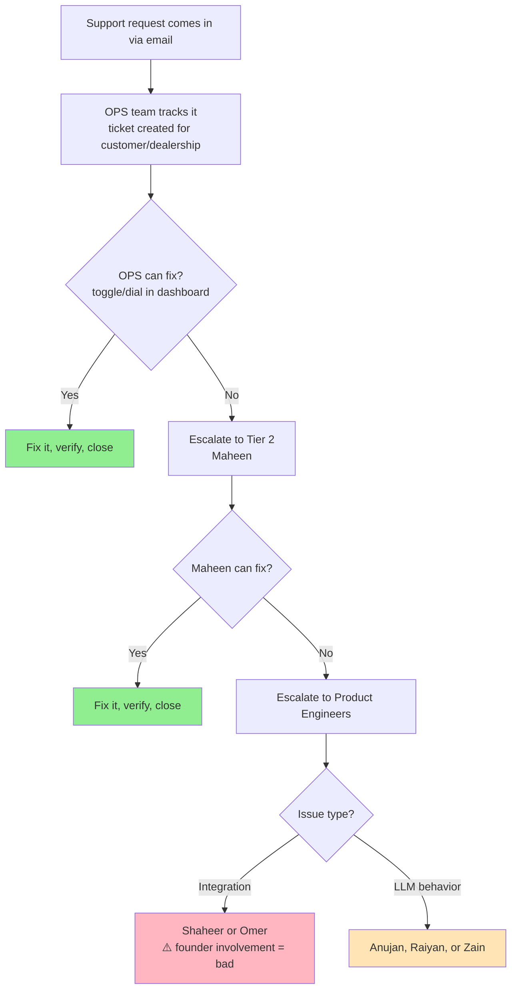
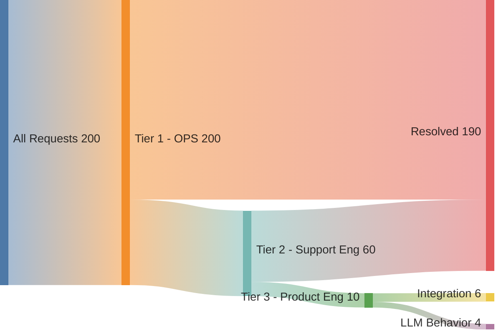
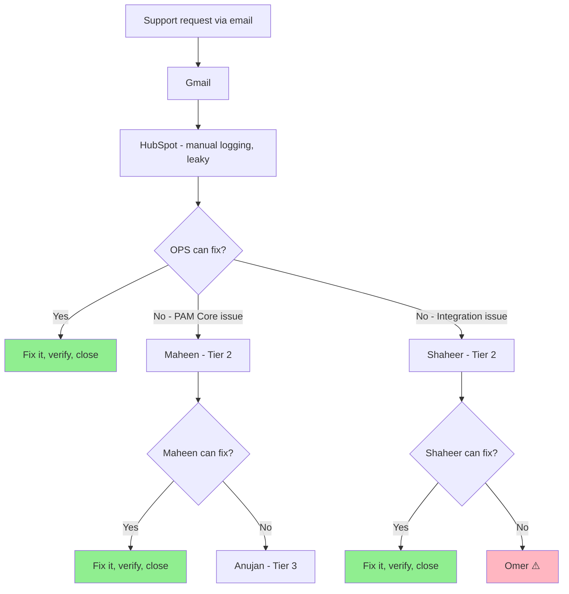

# OPS Meeting: Waqar & Amina

**Purpose:** Understand the onboarding/support process from OPS perspective

---

## Meeting Structure

### 1. Show the Diagram — "Is this how it works?"

Let them correct it. Where is this wrong? What's missing?

---

### Example: What Healthy Looks Like

**Assumptions:** 500 dealerships, ~200 support requests/month

| Stage | Who | Volume | Resolved | Escalated | Resolution Rate |
|-------|-----|--------|----------|-----------|-----------------|
| **Tier 1** | OPS (Waqar, Amina) | 200 | 140 | 60 → Tier 2 | 70% |
| **Tier 2** | Support Eng (Maheen) | 60 | 50 | 10 → Tier 3 | 83% |
| **Tier 3** | Product Eng | 10 | 10 | — | 100% |

**Healthy targets:**
- Tier 1 resolves 70-80% of all requests
- Tier 2 resolves 80-90% of what they receive
- Tier 3 should see <5% of total requests

**Red flags:**
- Tier 1 resolution < 50% → OPS toolkit is too limited
- Tier 2 escalates > 20% → Maheen needs better tooling or there are too many bugs
- Tier 3 > 10% of total → Product engineers pulled into support too much

**Questions to ask:**
- "What do you think the actual split is today?"
- "Do you have visibility into this? Can you pull these numbers from HubSpot/Linear?"
- "How do you track what comes in and where it goes?"

**Ideal state:** They can show you a report or dashboard that breaks down:
- Total requests per month
- Resolved at Tier 1 vs escalated
- Resolved at Tier 2 vs escalated to Tier 3
- Time to resolution at each tier

**If they can't pull this data:** That's a finding. Before hiring, you might need to instrument the process so you can measure whether new hires actually help.

---

### 2. Name the Problem — Let Them React

> "We're signing more dealerships than ever. I want to understand where the process feels stretched—what's working, what's not, and what would help."

Then listen. Let them tell you what the real problems are.

---

### 3. Ask — "How do you think we could solve it?"

Don't come with solutions. Let them propose what they need:
- More people?
- Better tools?
- Different process?
- Something else?

---

## Follow-Up Questions (If Needed)

Use these to go deeper if the conversation stalls or stays surface-level.

### On the Gap Between SOP and Reality
- "Where does the onboarding SOP break down in practice?"
- "What steps take longer than they should?"
- "What's not in the SOP that you wish people knew?"

### On the Human Side
- "What's the most frustrating part of your day?"
- "When do you feel like you're waiting on someone else?"
- "What makes a dealership easy vs hard to onboard?"

### On Patterns
- "Are there customers that just... flow through? What's different about them?"
- "What's the most common reason you have to follow up multiple times?"

### On Engineering Involvement
- "When you need help from engineering, what's that conversation like?"
- "Is there anything you wish you could do yourself but can't?"

### On Observability
- "How do you track what's coming in and where things get stuck?"
- "Can you pull data on how many requests came in last month?"
- "Do you tag issues by type?"

---

## What I'm Curious About (For My Reference)

| Question | Why It Matters |
|----------|----------------|
| Is there observability into support volume/types? | If no, can't measure improvement |
| What % of requests can OPS handle alone? | Tells us if toolkit is the bottleneck |
| What % escalates to Maheen? | Tells us if we need more Tier 2 capacity |
| What % escalates past Maheen to product eng? | Tells us if Maheen is blocked by tooling or skill |
| Are escalations bugs, missing features, or one-offs? | Determines if solution is hires vs product investment |

---

## Possible Outcomes

**If they can't answer with data:**
→ First priority might be building observability before hiring

**If most requests are handled by OPS:**
→ Process is working, maybe just need more OPS headcount

**If most requests escalate to Maheen:**
→ Need more Tier 2 Support Engineers

**If most requests escalate past Maheen:**
→ Maheen needs better tooling/access, or we need more senior support engineers

**If escalations are mostly one type (e.g., integrations):**
→ Might need a specialist rather than generalist

---

## Notes

**Meeting transcript:** [Granola notes](https://notes.granola.ai/t/c6ce4c86-5c83-4b8d-8188-1118a2ce9cb2)

---

### What They Said the Process Actually Is

**Triage flow (corrected):**
- Gmail → HubSpot (leaky — manual logging required)
- Three escalation paths from OPS (Tier 1):
  - PAM core issues → Maheen (Tier 2)
  - Integration/scheduler issues → Shaheer (Tier 2)
- Triage decision factors:
  1. Conversation analysis — PAM repeating/glitching behavior
  2. Request ID lookup using Omer's new tool
  3. Node-level debugging to identify failure points
- OPS checks: flags, test replication, OSS codes, service matching
- Knowledge sharing via huddles and Slack #support-engineering channel

**Updated flow diagram:**

---

### What They Said the Problems Are

**1. Integration Setup Bottlenecks (Onboarding)**
- Integration setup with service providers is the main stopper
- Significant delays from third-party providers:
  - **X Time:** 24-hour delay after customer accepts invite
  - **MyKaarma:** 24-48 hour delays minimum
  - **CDK:** 2-3 weeks setup time
  - **Rentals flow:** Extended setup periods
- Customer frustration: *"Signed contract 3 weeks ago, still not live"*
- Dashboard setup is simple — integration always needs extra testing/validation

**2. Support Analytics Gaps (Observability)**
- **No current visibility** on ticket volumes/escalation rates
- Manual end-of-day counts: *"Was it 1-2 tickets or 10-12 to engineering?"*
- Email threads ≠ actual tickets (one email = multiple requests)
- Past 7 days: 44 new conversations, 35 resolved (but reporting limitations noted)
- Planned Gmail-Linear integration for proper ticketing system

**3. Maheen Bottleneck (Tier 2 Capacity)**
- Maheen not responding within 3-4 days to support requests
- Working on feature development vs support focus
- Creates escalation delays to Anujan/others
- **Finding:** Support engineers are being pulled into feature work

---

### What They Think Would Help

- Gmail → Linear integration for proper ticketing
- Dedicated support engineering capacity (not pulled into feature work)
- Better observability into ticket volume and escalation rates

---

### Key Takeaways

| Finding | Implication |
|---------|-------------|
| No observability into support volume | Can't measure improvement — need to instrument first |
| Maheen split between support and features | Support is losing — need dedicated support capacity |
| Two escalation paths (PAM Core vs Integration) | Confirms need for both types of Tier 2 support |
| Integration delays are third-party driven | Not solvable with headcount — process/tooling issue |
| Gmail → HubSpot is leaky | Need proper ticketing (Linear integration planned) |

---

### Action Items

1. **Instrument support process** — Get Gmail-Linear integration working so we can measure volume/escalation rates
2. **Define Maheen's role** — Is she Support Eng or Product Eng? Can't be both effectively
3. **Revisit hiring plan** — Do we need:
   - Another Maheen (PAM Core Support Eng)?
   - A Shaheer-type (Integration Support Eng)?
   - Or better tooling/process first?

---

### Hiring Implications

**Before hiring more support engineers:**
- Need observability to measure if new hires actually help
- Need to decide: is Maheen dedicated support or not?

**If we hire:**
- Likely need **two types** of Tier 2 support:
  - PAM Core Support (like Maheen) — LLM behavior, conversation issues
  - Integration Support (like Shaheer) — DMS integrations, scheduler issues
- Integration delays are third-party — more people won't fix that

**Open question:** Is the bottleneck Maheen's capacity, or Maheen's focus? If she's doing feature work, adding another person who also does feature work won't help.
