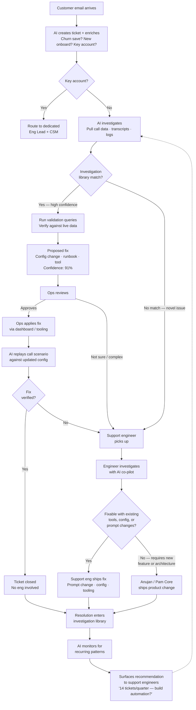
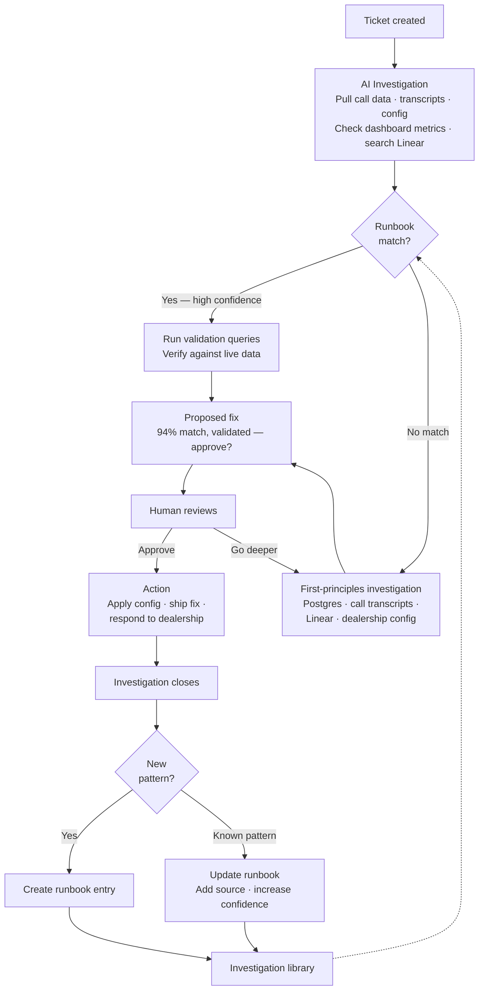
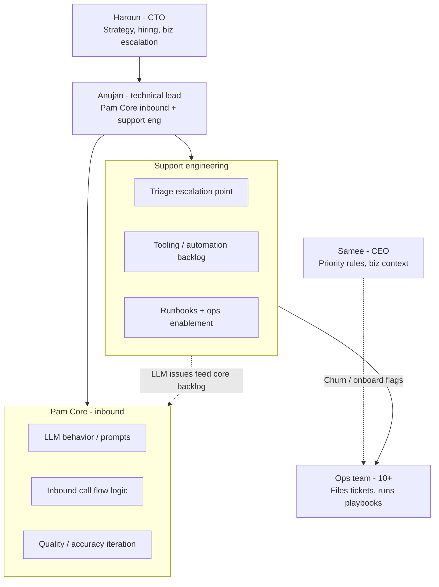

# Project Escalation Zero

**Author:** Haroun Ansari, CTO | **Date:** March 16, 2026

## The Vision

It's a Wednesday afternoon. Kareem posts in `#support-eng` with an alert emoji: "Yo! What happened here???" A customer at Fair Oaks called in, got transferred to their service advisor, the advisor picked up — and then Pam took the call back and told the customer "the team is busy." Kareem tags Anujan directly. He's never seen this behavior before. It's scary.

That same week, Ashlee flags that Toyota of Stamford's callers are speaking clear English, but Pam is responding in Spanish. She's seen it before — Piazza Mazda had the same issue two weeks ago, triggered when a customer said "yes" after the greeting. Fayzan separately reports the same thing at the same dealership a few days later. Three people, three tickets, one root cause that nobody connected.

Meanwhile, Abdul posts that Midway Chevy's Pam used a tire opcode for a non-tire service. Nour reports Mountain View Honda's Pam is booking the wrong oil change type — MVLOF instead of LOF. Zach finds that Luv Kia's Pam mapped a state inspection to an opcode that doesn't exist. Three different dealerships, three different ops team members investigating from scratch, same category of problem: service matching failures.

This is what support looks like today. Smart people doing investigative work in isolation, tagging engineers in Slack, waiting for someone to pull call transcripts and check dashboards manually. The engineer stops what they're building, opens a call link, listens to the recording, traces the logs, figures out the root cause, pushes a fix, and goes back to their product work — an hour or two later, with their focus destroyed. Next week, the same category of issue comes in from a different dealership. A different person investigates from scratch. The system didn't learn anything.

**In the new world, the system already knows.**

The Fair Oaks email arrives. The system reads it, creates a Linear ticket, and immediately investigates. It pulls the call transcript, sees that the transfer connected successfully — the advisor answered — but then Pam re-entered the call 8 seconds later. It checks the call flow logs and finds a race condition: the transfer confirmation signal arrived after a timeout threshold, so Pam treated it as a failed transfer and reclaimed the call. It searches the investigation library — this pattern has never been seen before. It flags it as a novel issue, P0 severity, and routes it directly to the support engineer on triage with the full investigation attached: transcript, logs, the exact timing of the race condition, and a hypothesis about the root cause. The engineer doesn't start from "let me look into this." They start from "the system found the bug, here's the evidence, let me validate and fix it."

The Spanish switching email arrives from Toyota of Stamford. The system creates a ticket and investigates — but this time, it finds a match. The investigation library already has an entry from the Piazza Mazda case two weeks ago: when a customer says a short affirmative word ("yes," "yeah," "sí") immediately after the English greeting, the language detection model sometimes misclassifies it as Spanish. The system sees that the Piazza Mazda fix was a configuration change — a language detection guardrail applied through the ops dashboard, no code change required. It checks — Toyota of Stamford doesn't have that guardrail applied. It proposes the fix to ops: "Apply the same language detection guardrail that resolved this for Piazza Mazda. Here's the config change. Confidence: 91%." An ops team member reviews the evidence, applies the configuration through the dashboard, and the system automatically replays the original call scenario against the updated config to verify the fix works — Spanish switching no longer triggers. The ops team member sees the green check, responds to the dealership, and closes the ticket. No engineer was interrupted. No one had to rediscover something the system already knew.

The Midway opcode email arrives. The system investigates, finds the wrong code was used, and checks the investigation library. It's seen 14 opcode mismatches in the last quarter. It resolves this specific ticket — proposing the correct opcode and the tool for ops to update it — but it also does something else. It surfaces a recommendation to the support engineers: "Service matching failures account for ~14 tickets per quarter across 8 dealerships. Current resolution requires manual opcode correction each time. Recommendation: build a validation layer that cross-checks selected opcodes against the dealership's active opcode list before confirming the booking. Estimated impact: eliminates this ticket category entirely."

A support engineer reviews the recommendation. The data is clear — consistent pattern, clean automation path, high leverage. They build the validation layer. It takes three days. After that, Pam doesn't just get corrected after booking the wrong service — she never books the wrong service in the first place. The ticket category disappears. The investigation library updates. The system got smarter.

**That's one week. Multiply it across every week, every month.**

The AI co-investigator handles the diagnostic work. Ops resolves issues using the tools and runbooks the system recommends. Support engineers aren't firefighters — they're architects, reviewing the patterns the system surfaces and building the tooling that eliminates entire categories of issues. The engineers on Pam Core never get pulled off product work unless something is genuinely novel — something the system has never seen and can't resolve with existing tools. When that does happen, the engineer's resolution becomes the newest entry in the investigation library, and the system handles it without them next time.

The result isn't faster support. It's a system that gets smarter every time it handles an issue. Where every resolved ticket makes the next one cheaper. Where ops becomes genuinely powerful — not because they memorized runbooks, but because an AI co-investigator does the investigation and surfaces the right fix. Where support engineers have 20x leverage — not because they work harder, but because they're building a machine that compounds.

**Two metrics tell you whether the machine is working.**

**Metric 1: Ops resolution rate.** What percentage of tickets does ops resolve without any engineer involvement? This is the system's core vital sign. If ops is resolving 30% of tickets today and 60% next quarter, the support engineers are building the right tooling, the runbooks are landing, and the AI is getting smarter. If it's flat, the system isn't learning — either the tooling isn't being built, or it's being built for the wrong categories.

**Metric 2: Total ticket volume.** How many tickets are coming in, period? Ops resolution rate going up while volume stays flat is good — it means the system is shifting work from eng to ops. Ops resolution rate going up while volume is going *down* is great — it means the system isn't just shifting work, it's eliminating root causes. Ticket categories are disappearing because the support engineers built automations or fixed the underlying product issue. If volume is rising, it doesn't matter how good the resolution rate is — the system is losing ground.

**Read them together.** Ops resolution rate is the leading indicator — it tells you the machine is working. Total ticket volume is the trailing indicator — it tells you the machine is compounding. A healthy system shows ops resolution rate climbing quarter over quarter, and total volume flattening or declining even as the dealership count grows. When both lines move in the right direction, you have a support engine that scales sublinearly with customer growth. That's the whole game.

---

## How It Works

### The Pipeline

### The Investigation Loop

This is what happens inside the "AI investigates" step. The same loop runs whether the AI triggers it automatically or a support engineer kicks it off manually.

The AI co-investigator doesn't need runbooks to work. The investigation skill already knows how to investigate from first principles — pull call data from Postgres, read transcripts, check dashboard metrics, search Linear for related tickets, look at the dealership's configuration. It produces structured findings on any ticket, for any dealership, without being told what to look for.

Runbooks are the acceleration layer. When the system matches a pattern it's investigated before, it doesn't blindly trust the match — it runs validation queries against live data to confirm the root cause still holds. What it skips is the hundred discovery queries that built the runbook in the first place. The runbook tells the system where to look; the validation confirms what it found. The more the loop runs, the more patterns get codified, the faster everything gets. But the system works on day one without a single runbook. It just takes longer and the confidence is lower.

### The Roles

**Ops** is the front line. When a dealership emails with an issue, the system creates the ticket and enriches it automatically — pulling in Samee's priority rules (churn save? onboarded within 30 days? key account?) and the AI's initial investigation. Ops reviews the AI's proposed fix, applies it through the dashboard or existing tooling, and verifies the result. They don't diagnose root causes. They don't read logs. They execute fixes the system has already validated, and they're good at it because the tooling makes them capable, not because they memorized every edge case.

**Support engineers** are the system builders. They own the triage rotation — one engineer scans the queue twice a day, assigns severity, routes tickets. But triage is the smaller part of their job. The bigger part is looking at the data the system generates — which categories recur, what's costing the most time, where the automation gaps are — and building the tooling that eliminates entire ticket categories. They ship prompt changes, config tooling, runbooks, and automations. They consult Anujan when they need architectural guidance or when a fix requires new product work, but the decision about what to build next is theirs. They're closest to the data, and they're empowered to act on it.

**Anujan** is the bridge, not the gatekeeper. He doesn't do triage. He doesn't approve the support engineers' backlog. He's the escalation point when a support engineer hits something that requires new feature work or an architectural change in the core inbound product. And he's the person who ensures the feedback loop closes — when support keeps surfacing the same issue and it traces back to a gap in the LLM layer, he's the one who prioritizes it on the Pam Core side. He doesn't need to be told — the investigation data makes the case.

**Samee** sets the business rules that determine priority. His three questions — is this a churn save, is this a new onboard, is this a key account — get encoded into the ticket creation process. He doesn't touch individual tickets. He sees the weekly summary: ops resolution rate, ticket volume trends, resolution times for high-priority customers. If the machine is working, those numbers tell him. If it's not, they tell him where.

### The Rituals

Daily (5 minutes, async): The triager scans the Linear queue twice — morning and early afternoon. Nothing stays in triage longer than half a business day. It either moves forward, gets bounced to ops, or gets escalated.

Weekly (30 minutes): Support engineers present what they're seeing in the data — ticket volume by category, recurring patterns, what they shipped last week and whether it moved the needle. Anujan is there to give input on core product implications and flag conflicts, not to review their backlog. Output is a summary posted to Slack that Samee and Haroun can read.

Monthly (30 minutes, optional): Haroun, Anujan, and Samee zoom out. Is the ops resolution rate trending up? Is total volume trending flat or down? Are there systemic issues that need a bigger investment? This is the strategic check.

---

## Getting There

Start at the vision and work backwards. By the time you reach today, the path is obvious.

### Stage 4: The System Compounds

The ops resolution rate is above 80%. Total ticket volume is trending down quarter over quarter, even as the dealership count grows. The engineering team is protected. The system compounds.

The investigation loop has run hundreds of times. The investigation library covers every common pattern. When the AI encounters a ticket it's seen before, it runs the validation queries, confirms the root cause against live data, and proposes the fix with a confidence score. Ops approves in minutes. The AI replays the call scenario to verify the fix landed. Ticket closed. No engineer touched it.

But the real power isn't speed. It's that the system discovers patterns the team never would have hypothesized. The AI notices that dealerships on DealerFX integrations have 3x the opcode mismatch rate of Xtime dealerships — and traces it to a difference in how fallback opcodes are structured between the two systems. Nobody programmed that rule. The system learned it from its own investigation history across hundreds of tickets.

Support engineers at this stage aren't reacting to what's broken. They're reviewing the system's recommendations about what to build next, ranked by projected ticket reduction. They ship a validation layer and watch a ticket category disappear from the weekly numbers. They build an ops tool and watch the ops resolution rate jump. Their judgment about what to build is the bottleneck — not their time investigating or firefighting.

This is possible because of what came before it.

### Stage 3: AI Co-Investigation

Before the system could compound, it had to investigate on its own.

This is where the process diagram becomes real. A customer email arrives and the AI creates a ticket automatically — enriched with Samee's priority rules by checking the CRM for churn risk, onboarding date, and account tier. The AI investigates immediately: pulls call data, reads transcripts, checks the dealership's configuration, searches Linear for related open tickets, matches against the investigation library.

When it finds a match, it doesn't blindly trust it. It runs validation queries against live data — does this dealership actually have the same configuration that caused the issue last time? Is the call pattern consistent with the prior root cause? If the validation holds, it proposes the fix to ops with the evidence and confidence score. Ops applies it through the dashboard. The AI replays the scenario. Green check. Done.

When it doesn't find a match, it still does the investigative legwork — pulling the data, structuring the findings, forming a hypothesis. The support engineer who picks up the ticket doesn't start from zero. They start from "the AI found X, checked Y, and thinks the root cause is Z — here's the evidence." The engineer validates, fixes, and the resolution becomes a new entry in the investigation library. Next time the system sees this pattern, it handles it without them.

The human's role changes. They stop being the researcher and become the reviewer. When the AI gets it right, the library updates automatically. When the AI gets it wrong and the human corrects it, that correction becomes the new entry. Either way, the system learns.

This is possible because of what came before it.

### Stage 2: The System Runs

Before the AI could investigate autonomously, the system had to actually be running — with real tickets, real triage, and real metrics.

This is the stage where `#support-eng` stops being the intake queue. Linear is the single source of truth. Ops doesn't Slack an engineer — they file a ticket, or more accurately, the system creates a ticket from the customer email and ops enriches it. The template captures the dealership, the integration, what happened, and the priority flags. Engineers never pick up work that isn't in the queue. This is the discipline that makes everything else possible.

The triage rotation is live. One support engineer owns triage each day. They scan the queue twice, assign severity using the combined framework — Samee's business tier plus technical severity — and route to the right person. Nothing stays in triage longer than half a day. The other support engineers are heads-down on the improvement backlog.

The metrics dashboard exists. This is critical — without it, the two numbers that matter are invisible. Every ticket in Linear gets tagged at resolution: resolved by ops or resolved by eng. A weekly automated report pulls the ops resolution rate and total ticket volume, broken down by category, integration, and severity. The support engineers can see which ticket categories are shrinking and which aren't. Samee and Haroun can see the two headline numbers without attending a meeting. The data doesn't just exist — it's visible, it's trusted, and it drives decisions. You can't run a data-driven support team if nobody can see the data.

The improvement backlog exists and is owned by the support engineers. They're tracking which categories recur, building runbooks for the common patterns, and shipping tooling that lets ops resolve issues independently. The ops resolution rate is being measured weekly. Repeat ticket rate is tracked. The support engineers present the data at the weekly review and decide what to build next based on it.

Runbooks exist for the obvious categories: transfer failures, opcode mismatches, scheduling errors, configuration issues. Ops can look up a runbook and execute a fix for the patterns that have been documented. Not all patterns are covered yet, but the library is growing and every new runbook is a category that ops can handle without pinging an engineer.

This is possible because of what came before it.

### Stage 1: Make It Honest

This is today. The starting line.

Move the intake from Slack to Linear. Set up a dedicated Support Engineering team in Linear with clean states: Triage, Investigating, Blocked, In Progress, Handed to Ops, Done. Add severity labels (P0–P3), type labels (one-off incident, recurring issue, tooling/automation), and source labels (which dealership, which integration). Build the ticket creation template that captures Samee's priority questions as structured fields, not free text.

Establish the discipline: ops files tickets, not Slack messages. If it's not in Linear, it doesn't exist. Engineers don't pick up work from a Slack ping. This is the hardest habit change and the most important one. Expect resistance. Push through it.

Set up the triage rotation among the support engineers. One person owns the queue each day. Define the escalation path: support engineer to Anujan for anything requiring new product work, Anujan to Haroun for anything requiring a business-level decision.

Start tracking the baseline metrics. How many tickets per week? What percentage does ops resolve without eng? What are the top recurring categories? You can't improve what you don't measure, and right now nobody knows these numbers.

None of this is hard. All of it is unfinished. The gap between where we are and Stage 2 is not a technology problem. It's a process discipline problem. The tools exist. The people are capable. The system just needs to be defined, agreed on, and enforced.

---

## Why This Matters

Forty support messages in two weeks. Most tagged an engineer. Most of those engineers were also building product. A day with three support pings is a day where the product work didn't move. That cost scales linearly with dealership count. The support engine makes it sublinear.

Every resolved ticket makes the next one cheaper. Every runbook makes ops more capable. Every automation eliminates a category entirely. You can 3x the dealership count without 3x-ing the engineering team — not because the engineers are working harder, but because the system is handling the throughput and the engineers are handling the judgment.

A support engineer who ships one automation that eliminates 14 tickets a quarter has done more than an engineer who resolved those 14 tickets individually. That's the 20x framing. That's the role we're building.

The methodology is validated. We proved AI co-investigation works on key accounts. The support engine applies the same methodology to every ticket, every dealership, every day. The architecture is right. The system needs to be built, turned on, and trusted.

You'll know whether it's working by watching two numbers:

**Ops resolution rate** — the percentage of tickets ops resolves without eng. The leading indicator. It tells you the machine is learning.

**Total ticket volume** — the raw count of tickets coming in. The trailing indicator. It tells you the machine is compounding.

Ops resolution rate climbing. Total volume flattening or declining. That's the whole game. Everything after that compounds.
